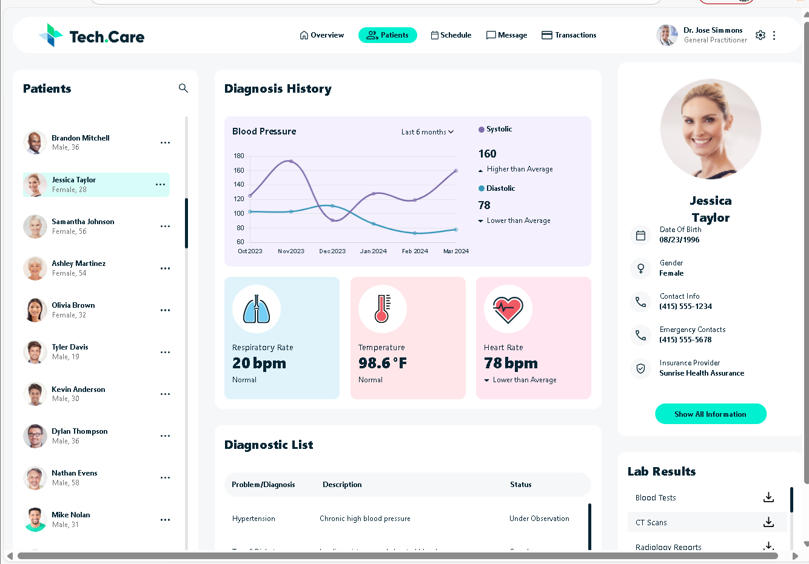

# 🧑‍⚕️ Patient Dashboard  
### _Freelance Pixel-Perfect Frontend Project_

<!-- Badges -->

---

## 📌 Overview

This project is a **pixel-perfect Patient Dashboard** built as part of a freelance assignment.  
The objective was to replicate a provided design exactly for a fixed screen width, implementing the UI in React while pulling real data from a provided API.  
The dashboard is mostly static, with dynamic rendering of patient information.

---

## 🎯 Project Requirements

- Clone the Figma design **pixel by pixel**
- Build for a **specific fixed screen width**
- Use **React + Vite + Tailwind**
- Fetch and render patient data from the provided API
- No backend logic needed  
- High visual accuracy required

---

## 🛠️ Tech Stack

- ⚛️ React (Vite)  
- 🎨 Tailwind CSS  
- 🖼 Custom SVG assets  
- 🌐 Native Fetch API  
- ✨ ESLint (default)

---

## 📡 API Used

https://fedskillstest.coalitiontechnologies.workers.dev/

---

## 🚀 Running Locally

\`\`\`sh
git clone https://github.com/Jazlan06/patient-dashboard.git
cd patient-dashboard
npm install
npm run dev
\`\`\`

The app will start on:  
👉 http://localhost:5173

---

## 📸 Screenshots

  

---

## 📄 License

This project was built as a freelance assignment.  
Not intended for commercial redistribution or reuse.

---

⭐ If this project was helpful or inspiring, consider starring the repo!

